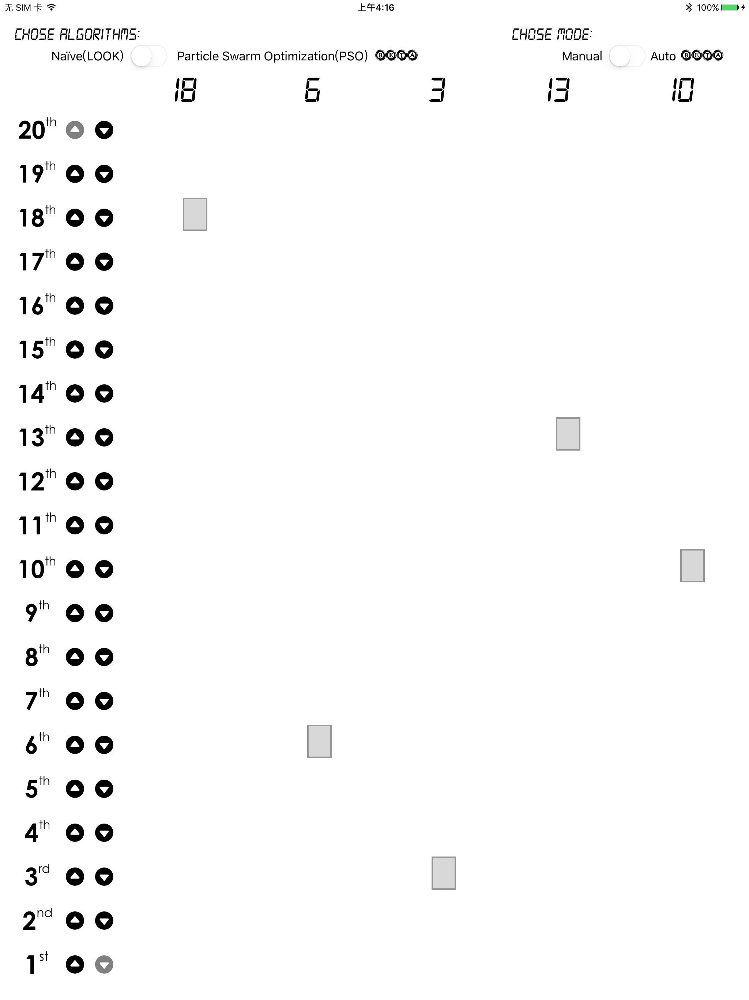
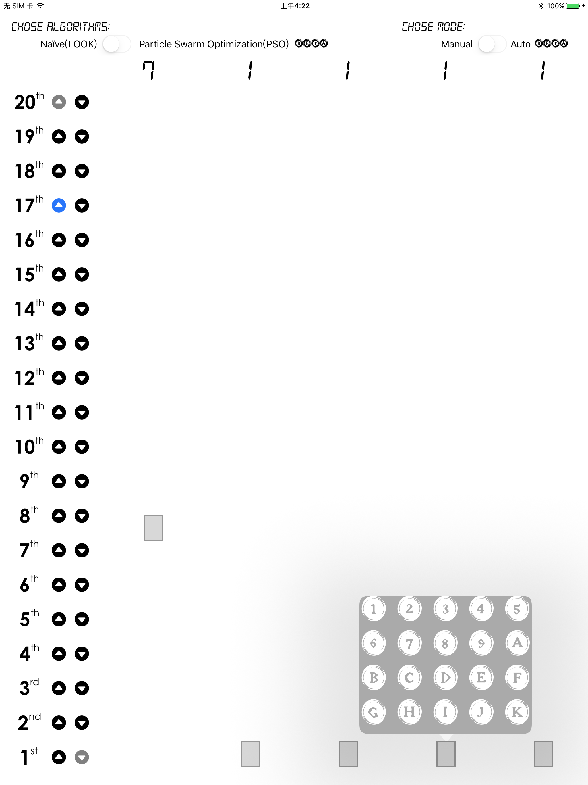

# Potions
42002403 Spring2017 Operating Systems Project by Dongqing WANG @ SSE, TJU

## Lift

a destination dispatch iOS app for multi-elevator

  

**DDL: May 7th, 2017**

### Requirements

某一层楼20层，有5部互联的电梯。基于线程思想， 编写一个电梯调度程序。并通过控制电梯调度，实现操作系统调度过程；学习特定环境下多线程编程方法；学习调度算法。

- 电梯应有一些按键
- 有数码显示器指示当前电梯状态
- 每层楼、每部电梯门口，有上行、下行按钮、数码显示
- 5部电梯相互联结

### Introduction

这是一个运行于iPad的模拟电梯调度系统，由于有20层5部电梯，为了保证用户体验，暂时只适配了12.9寸。

启动App后，您可以选择在左侧的每层楼中给出上楼和下楼的指令，电梯会根据SCAN调度算法响应，并随机生成一个更高／更低楼层作为您的目的地。您也可以手动点击电梯，在弹出来的``popoverView``中选择目的楼层。

此外，还提供了随机生成乘客指令的功能，您只需打开右上角的自动模式开关。

基于粒子群优化算法的实时调度功能仍在编写中，同时由于时间紧迫，并没有良好的封装。

如果您的markdown阅读器不支持$LaTeX$，您可以选择[html](README.html)获得更好的阅读体验。

### Algorithms

#### Naïve Algorithms

朴素的非实时电梯调度算法有很多种，如下：

1. First Come First Serve(FCFS)

   先来先服务算法，这是一种最为简单的电梯调度算法，根据乘客发出指令的先后次序进行调度，实现简单无需操作队列且较为公平，但可能因为某个元素处理时间过长而出现等待超时。

2. Shortest Seek Time First(SSTF)

   最短寻找楼层时间优先算法，注重电梯寻找楼层的优化，即根据最短楼层进行响应，具有平均响应时间较短但方差较大的特点，并可能出现有些指令因距离过远长时间得不到响应。

3. SCAN

   扫描算法，即按照楼层顺序依次服务，使电梯在最底层和最高层间往返运行时，响应各个指令。具有较高的效率，但作为非实时的算法，仍具有无法较好适用变化的特点。

4. LOOK

   即在本项目中使用的朴素算法(Naïve Algorithms)。

   通过对SCAN算法中的最底层和最高层进行优化，在到达要求队列的最大值和最小值时即开始往返。

5. Shortest Access Time First(SAFT)

   最短访问时间优先算法，即注重最快的到达时间，有较之SSTF算法更好的一般性的优点和同样的出现长时间无响应的缺点。

#### PSO Algorithms

对于实时优化的调度算法，这里主要介绍粒子群优化算法(Particle Swarm Optimization, PSO)。

本项目原计划仅使用PSO算法，但由于iOS对大量数据的处理较差，仅有[Accelerate Framework](https://developer.apple.com/reference/accelerate)提供部分底层API，故拖延了进度，现记录目前成果如下。

##### 粒子编码

作为随机启发式优化算法，编码方法十分重要，而正是iOS只提供少量简单的数据处理API使我对大量的粒子编码操作产生了困难。

目前我是根据一个粒子对应一个调度方案，每个粒子有``liftRequestQueue.count``的维度，即等于电梯群控系统中所有指令个数。每个维度上有``liftCount = 5``个离散值，对应着5部电梯进行响应。

##### 符号说明

|    符号     |     数据结构     |       说明       |
| :-------: | :----------: | :------------: |
| $T_w(i)$  | ``[Double]`` | 第$i$个乘客的实际候梯时间 |
| $T_r(i)$  | ``[Double]`` | 第$i$个乘客的实际乘梯时间 |
|   $K_1$   |   ``Int``    |   电梯运行一层所需时间   |
|   $K_2$   |   ``Int``    |   电梯停靠一层所需时间   |
|    $m$    |  ``[Int]``   |  电梯需响应的停靠任务数   |
| $F_{max}$ |  ``[Int]``   |   电梯同向到达最远楼层   |
| $F_{min}$ |  ``[Int]``   |   电梯反向到达最远楼层   |
|   $N_p$   |   ``Int``    |   电梯系统的总乘客数    |
|   $N_e$   |   ``Int``    |   群控系统中电梯总数    |

##### 约束条件

- 避免长时间候梯

  $0 \leq T_w(i) \leq limit(AWT)$

- 避免长时间乘梯

  $0 \leq T_r(i) \leq limit(ART)$

- 避免电梯超载

  $0 \leq Q_i \leq limit(CallCount)$

##### 适应度函数

- Average Waiting Time($AWT$, 平均候梯时间)

  $AWT = \frac{\sum_{i=1}^{N_p}{T_w(i)}}{N_p}$

  其中，

  - 呼叫方向与电梯运行同向，且发生楼层$F_c$在电梯所在$F_0$前方

    $T_w(i) = |F_c - F_0| * K_1 + m*K_2$

  - 呼叫方向与电梯运行同向，且发生楼层$F_c$在电梯所在$F_0$后方

    $T_w(i) = (|F_{max}-F_0| + |F_{max} - F_{min}| + |F_c - F_{min}|) * K_1 + m * K_2$

  - 呼叫方向与电梯运行反向

    $T_w(i) = (|F_{max}-F_0| + |F_{max} - F_c| * K_1 + m * K_2)$

  - 呼叫方向与电梯运行同向，且$F_c = F_0$

    $T_w(i) = 0$

- Average Riding Time($ART$, 平均乘梯时间)

  $ART = \frac{\sum_{i=1}^{N_p}T_r(i)}{N_p}$

- Energy Consumption($EC$, 系统运行能耗)

  由于电梯加减速时的能耗远大于直行匀速运行和静止能耗，故这里简单的考虑其等于电梯的起停次数。

  $EC = \sum_{i=1}^{N_e}{E(i)} $

- Fitness Function(适应度函数)

  $S_i = w_1S_{AWTi}+w_2S_{ARTi}+w_3S_{RPCi}$

##### 应用

至此，我们可以根据不同模式给予三个指标不同的权重来达到不同情景下进一步优化分配的目的。

| 交通模式 | $w_1$ | $w_2$ | $w_3$ |
| :--: | :---: | :---: | :---: |
| 上行高峰 |  0.6  |  0.2  |  0.2  |
|  层间  |  0.5  |  0.2  |  0.3  |
|  空闲  |  0.4  |  0.2  |  0.2  |
| 下行高峰 | 0.55  |  0.2  | 0.25  |

我们通过[CocoaPods](https://cocoapods.org/)来使用第三方库[PSOLib](https://github.com/IvanRublev/PSOLib)，代码如下：

```swift
  func SPODispatch() {
    let spaceMin: [Int] = Array(repeating: 0, count: liftRequestQueue.count)
    let spaceMax: [Int] = Array(repeating: 5, count: liftRequestQueue.count)
    let searchSpace = PSOSearchSpace(boundsMin: spaceMin, max: spaceMax)
    let optimizer = PSOStandardOptimizer2011(for: searchSpace, optimum: 0, fitness: { (positions: UnsafeMutablePointer<Double>?, dimensions: Int32) -> Double in
      // AWT: Average Waiting Time
      // ART: Average Riding Time
      // EC: Energy Consumption
      // Total
      var sFitnessFunc: Double = 0
      return sFitnessFunc
    }, before: nil, iteration: nil) { (optimizer: PSOStandardOptimizer2011?) in
      // to do
    }
    optimizer?.operation.start()
  }
```

### Architecture

考虑到两种算法的兼容，本项目数据结构的处理较为复杂。

**基本常量的处理**：

|        名称        |     类型      |      说明       |
| :--------------: | :---------: | :-----------: |
|  ``floorCount``  |   ``Int``   |      层数       |
|  ``liftCount``   |   ``Int``   |     电梯数量      |
|  ``distanceX``   | ``CGFloat`` |     电梯间距      |
|  ``distanceY``   | ``CGFloat`` |      楼层高      |
| ``liftVelocity`` | ``Double``  | 电梯通过一层的时间(速度) |
|  ``liftDelay``   | ``Double``  |    电梯停靠时间     |

**界面变量的处理**：

|          名称           |        类型        |      说明       |
| :-------------------: | :--------------: | :-----------: |
|   ``upDownButton``    | ``[[UIButton]]`` |  每层楼中向上向下按钮   |
|   `` liftDisplay``    |  ``[UILabel]``   |  每个电梯的实时层数显示  |
| ``liftCurrentButton`` |   ``[[Bool]]``   | 每个电梯内部按钮是否被按下 |
|       ``lift``        |    `[UIView]`    |     每个电梯      |

**电梯调度变量的处理**：

|               名称               |        类型        |                说明                 |
| :----------------------------: | :--------------: | :-------------------------------: |
|    ``liftCurrentPosition``     |  ``[CGFloat]``   |              电梯实时位置               |
|    ``liftCurrentDirection``    |    ``[Int]``     |              电梯实时方向               |
|        ``liftBeingSet``        |    ``[Bool]``    | 在``popoverView``dismiss后检查是否有新的指令 |
|    ``liftDestinationDeque``    | ``[Deque<Int>]`` |            每个电梯的目标楼层队列            |
| ``liftRandomDestinationDeque`` | ``[Deque<Int>]`` |           根据指令随机生成的目标队列           |
|      ``liftRequestQueue``      |  ``Queue<Int>``  |           总调度系统中未被分配的指令           |
|      `` liftInAnimation``      |    ``[Int]``     |            当前电梯是否在实行动画            |

由于实时更新电梯层数在主线程会阻塞UI，在新开的线程中造成与主线程不同步的情况，这里使用定时器`Timer`解决。

```swift
let timer = Timer(timeInterval: 0.1, repeats: true) { (timer) in
  for i in 0..<self.liftCount {
    self.updateLiftDisplay(currentFloor: self.getLiftCurrentFloor(liftIndex: i), liftIndex: i)
    self.updateCurrentDirection(liftIndex: i)
  }
}
RunLoop.current.add(timer, forMode: .commonModes)
timer.fire()
```

在每次用户dismiss ``popoverview``时进行电梯内按钮是否按下的检查，将被按下的层数加入该电梯的目标楼层队列。

```swift
func inLiftScan(liftIndex: Int) {
  for i in 0..<floorCount {
    if liftCurrentButton[liftIndex][i] {
      liftDestinationDeque[liftIndex].enqueueFirst(i)
      liftCurrentButton[liftIndex][i] = false
    }
  }
  _ = liftDestinationDeque[liftIndex].sorted()
  liftAnimation(liftIndex: liftIndex)
}
```

在用户在楼层处发出指令后，为了更接近实际，这里使用了根据方向指令随机生成目标楼层函数。

```swift
func randomGenerateDestination(destinationTag: Int) -> Int {
  if destinationTag < 0 {
    return Int(arc4random() % UInt32(abs(destinationTag + 1))) + 1
  } else {
    return floorCount - Int(arc4random() % UInt32(floorCount - destinationTag))
  }
}
```

**朴素的调度算法**：

这里使用LOOK算法，对于每一个指令，寻找与其同向或静止的最近的电梯进行响应。

针对电梯先上去接人后再下行的情况，为了避免电梯由于对目标楼层队列排序后先去随机生成的目标楼层而没有接人，通过设置一个``liftRandomDestinationDeque``队列进行临时存储，在电梯接人后再``enqueue``进目标楼层队列``liftDestinationDeque``。

```swift
func naiveDispatch() {
  if liftRequestQueue.isEmpty {
    return
  }
  let currentRequest = liftRequestQueue.dequeue()
  print("currentRequest: " + String(currentRequest))
  if currentRequest < 0 {
    var closestLiftDistance = 20
    var closestLift = -1
    for i in 0..<liftCount {
      if liftCurrentDirection[i] <= 0 {
        if closestLiftDistance > abs(getLiftCurrentFloor(liftIndex: i) + currentRequest) {
          closestLift = i
          closestLiftDistance = abs(getLiftCurrentFloor(liftIndex: i) + currentRequest)
        }
      }
    }
    if closestLift != -1 {
      liftDestinationDeque[closestLift].enqueueFirst(-currentRequest - 1)
      _ = liftDestinationDeque[closestLift].sorted()
      liftRandomDestinationDeque[closestLift].enqueueFirst((randomGenerateDestination(destinationTag: currentRequest) - 1))
      return
    } else {
      liftRequestQueue.enqueue(currentRequest)
    }
  } else {
    var closestLiftDistance = 20
    var closestLift = -1
    for j in 0..<liftCount {
      if liftCurrentDirection[j] >= 0 {
        if closestLiftDistance > abs(getLiftCurrentFloor(liftIndex: j) - currentRequest) {
          closestLift = j
          closestLiftDistance = abs(getLiftCurrentFloor(liftIndex: j) - currentRequest)
        }
      }
    }
    if closestLift != -1 {
      liftDestinationDeque[closestLift].enqueueFirst(currentRequest - 1)
      _ = liftDestinationDeque[closestLift].sorted()
      liftRandomDestinationDeque[closestLift].enqueueFirst((randomGenerateDestination(destinationTag: currentRequest) - 1))
      return
    } else {
      liftRequestQueue.enqueue(currentRequest)
    }
  }
}
```

**电梯动画函数**：

由于iOS动画执行是多线程的，对具有先后顺序逻辑的代码和函数在回调中执行。

```swift
func liftAnimation(liftIndex: Int) {
  if liftDestinationDeque[liftIndex].isEmpty {
    return
  }
  liftInAnimation[liftIndex] = liftInAnimation[liftIndex] + 1
  var destinationFloor: Int = 0
  if liftCurrentDirection[liftIndex] == 0 {
    let currentFloor = getLiftCurrentFloor(liftIndex: liftIndex)

    if abs(currentFloor - (liftDestinationDeque[liftIndex].first! + 1)) < abs(currentFloor - (liftDestinationDeque[liftIndex].last! + 1)) {
      destinationFloor = liftDestinationDeque[liftIndex].dequeueFirst() + 1
    } else {
      destinationFloor = liftDestinationDeque[liftIndex].dequeueLast() + 1
    }
  } else {
    if liftCurrentDirection[liftIndex] > 0 {
      destinationFloor = liftDestinationDeque[liftIndex].dequeueLast() + 1
    } else {
      destinationFloor = liftDestinationDeque[liftIndex].dequeueFirst() + 1
    }
  }
  print("destination floor: " + String(destinationFloor))
  let destinationDistance = CGFloat(destinationFloor - getLiftCurrentFloor(liftIndex: liftIndex)) * (distanceY)
  let destinationTime = liftVelocity * abs(Double(destinationFloor - getLiftCurrentFloor(liftIndex: liftIndex)))
  UIView.animate(withDuration: destinationTime, delay: liftDelay, options: .curveEaseInOut, animations: {
    self.lift[liftIndex].center.y = self.lift[liftIndex].center.y - destinationDistance
  }, completion: { (finished) in
    self.updateLiftDisplay(currentFloor: self.getLiftCurrentFloor(liftIndex: liftIndex), liftIndex: liftIndex)
    self.updateUpDownButton(destinationTag: (self.liftCurrentDirection[liftIndex] * destinationFloor), liftIndex: liftIndex)
    if !self.liftDestinationDeque[liftIndex].isEmpty {
      self.liftAnimation(liftIndex: liftIndex)
    }
    self.liftInAnimation[liftIndex] = self.liftInAnimation[liftIndex] - 1
  })
}
```

在电梯到达接到乘客后，取消对应按钮的高亮。

```swift
func updateUpDownButton(destinationTag: Int, liftIndex: Int) {
  print("destinationTag: " + String(destinationTag))
  if destinationTag == 0 {
    if !liftRandomDestinationDeque[liftIndex].isEmpty {
      liftDestinationDeque[liftIndex].enqueueFirst(liftRandomDestinationDeque[liftIndex].dequeueFirst())
      upDownButton[getLiftCurrentFloor(liftIndex: liftIndex) - 1][0].isSelected = false
      upDownButton[getLiftCurrentFloor(liftIndex: liftIndex) - 1][1].isSelected = false
    }
    return
  }
  if destinationTag > 0 {
    if upDownButton[destinationTag - 1][0].isSelected {
      upDownButton[destinationTag - 1][0].isSelected = false
    }
  } else {
    if upDownButton[-destinationTag - 1][1].isSelected {
      upDownButton[-destinationTag - 1][1].isSelected = false
    }
  }
  if !liftRandomDestinationDeque[liftIndex].isEmpty {
    liftDestinationDeque[liftIndex].enqueueFirst(liftRandomDestinationDeque[liftIndex].dequeueFirst())
    upDownButton[abs(destinationTag) - 1][0].isSelected = false
    upDownButton[abs(destinationTag) - 1][1].isSelected = false
  }
}
```

### Video

[YouTube](https://youtu.be/iSkEq7rmBbU) or [locally](Lift.mp4)

### Screenshot

*Static:*



*Dynamic:*



### Under Construction

- [ ] PSO Algorithms
- [ ] Refactor the Project with MVC

### Reference

[1] James Kennedy, Russell Eberhart: [Particle Swarm Optimization](https://www.cs.tufts.edu/comp/150GA/homeworks/hw3/_reading6%201995%20particle%20swarming.pdf), Purdue School of Engineering and Technology Indianapolis, 1995.

[2] Zhenshan Yang, Cheng Shao, Guizhi Li: [Multi-Objective Optimization for EGCS Using Improved PSO Algorithm](http://ieeexplore.ieee.org/document/4282871/), American Control Conference, 2007.

[3] Hesam Izakian, Behrouz Tork Ladani, Ajith Abraham, Vaclav Snasel: [A DISCRETE PARTICLE SWARM OPTIMIZATION APPROACH FOR GRID JOB SCHEDULING](http://www.softcomputing.net/ijicic20101.pdf), International Journal of Innovative Computing, Information and Control, 2010.

[4] Parsopoulos KE, Vragatis MN: [Recent approaches to global optimization problems through Particle Swarm Optimization](https://link.springer.com/article/10.1023/A:1016568309421), Natural Computing, 2002.

[5] 郭文忠, 陈国龙: 离散粒子群优化算法及其应用, 清华大学出版社, 2012.


------


## Memory Management

a memory management simulation app

  

**DDL: May 25th, 2017**

### Requirements

动态分区分配方式的模拟：

- 假设初始态下可用内存640K，分别用首次适应算法(first-fit)和最佳适应算法(best-fit)进行内存块的分配和回收，并显示每次分配和回收的空闲分区链的情况。

请求调页存储管理方式的模拟：

- 假设每个页面可存放10条指令，分配给一个作业的内存块为4。模拟一个作业的执行过程，该作业有320条指令(即32页地址空间)。
- 在模拟过程中，若所访问指令在内存中，则显示其物理地址，并转到下一条指令；反之，则发生缺页，此时记录缺页次数，并将其调入内存。若4个内存块中已装入作业，则需要进行页面置换。
- 所有320条指令执行完成后，计算并显示作业执行过程中发生的缺页率。

### Introduction


### Algorithms

**对Online Algorithms 下界的分析**

> *Yao's Minimax Principle:*
>
> if for some input distribution no deterministic algorithm is k-competitive, then no randomized k-comprtitive algorithm exists. 

假设有$k+1$页和$n$次访问，对于每次访问，每个页被请求的可能性为$\frac{1}{k+1}$，即可以认为长度为$n$的$k+1$页的均匀分布。

对于Online Algorithm，在任何时刻内存中都只有$k$页，所以均有$\frac{1}{k+1}$的可能性请求页不在内存中。因此，在$n$次请求后的页错误数的期望为$\frac{n}{k+1}$，每次错误的平均请求数的期望为$k+1$,即$\Theta(k)$。

对于Offline Algorithm，假设从开始都有权获取整个访问序列。作为最优算法的OPT，其每接收$k+1$个不同页请求的有关期望如下：

- 总请求数期望$E[No.requests\ total] = \sum_{i=1}^{k+1}E[No.requests\ between\ the\ i-1^{th}\ distinct\ request\ and\ the\ i^{th}]$

- 在$i-1$次不同请求后每次请求不同的$i$的概率

  $P(each\ request\ after\ the\ i-1^{th}\ distinct\ request\ is\ the\ i^{th}\ distinct\ request) = \frac{k+2-i}{k+1}$

  $E[No.requests\ between\ the\ i-1^{th}\ distinct\ request\ and\ the\ i^{th}] = \frac{k+1}{k+2-i}$

- 求的总请求数期望

  $E[No.requests\ total] = \sum_{i=1}^{k+1}\frac{k+1}{k+2-i} = (k+1)*(\sum_{j=1}^{k+1}\frac{1}{j}) = \Theta(klogk)$

根据*Yao's Minimax Principle*，对于页置换算法，没有好于comprtitive ratio of fault为$\Theta(logk)$的随机算法。


### Architecture

### Video

### Screenshot


------


## File Management

a file management simulation app

  

**DDL:**

### Requirements

### Introduction

### Algorithms

### Architecture

### Video

### Screenshot


------

### License

- Created by Yang LI(1452669) under MIT LICENSE
- Open Sourced on [GitHub](https://github.com/zjzsliyang/Potions)
- Fork & Issues are both welcomed